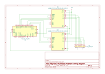

# magnetic-microrobot

Magnetic microrobot manipulation system that adapts a flex PCB platform inspired by the Hackaday “2D Stepper Motor Etched on PCB” project.

## Overview

This repository contains code, schematics, and CAD files for a mm-scale magnetic robot control platform designed for open and closed loop trajectory execution, computer vision robot tracking, and micromanipulation.

The system uses a two-layer flex PCB with orthogonal serpentine traces powered by two stepper motor drivers. The resulting configuration generates magnetic fields that allow a mm-scale magnet placed on the PCB to be manipulated in 8 directions. 

## Features 

- Live tracking of robot and obstacle positions for closed-loop control and image processing
- Direction control and motor driver actuation via Arduino serial communication
- MATLAB A* pathfinding algorithm and visualization for trajectory planning and obstacle avoidance 

### Included Files

- FLEX PCB Gerber Files for manufacturing
- DXF file for acrylic base with cutouts for PCB mounting and wiring
- STL files for obstacles and manipulation payloads 

## Requirements

- MATLAB Support Package for USB Webcams
- MATLAB Image Processing Toolbox

## File Organization

- Upload microbot_multidirection_serial.ino to Arduino Uno

## Hardware Components 

- Flex PCB with stiffener
- N52 disk magnets: 1mm x 0.5mm (4 ct) and 3mm x 1mm (1 ct)
- Arduino Uno
- 170 pin breadboard
- A4988 Stepper Motor Drivers (2 ct)
- 3/16" thick acrylic sheet: each base has approximate dimensions 4.2" x 5.9" 
- M3 nuts and bolts for mounting 
- Webcam & webcam stand

## Wiring Schematic
Default pin connections for Arduino, motor drivers, and PCB. Drivers are full-stepping, which results in the smoothest motion.

